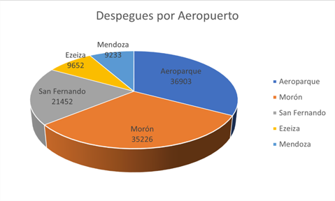
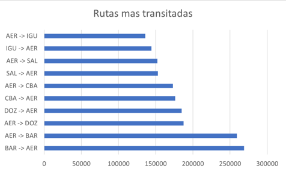
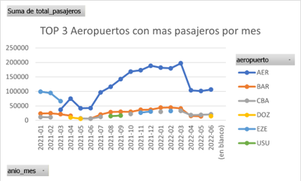
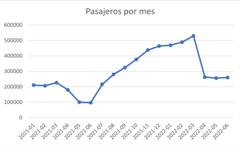

# Argentina Aviation Data Pipeline ✈️🇦🇷

## Project Overview
This project implements an automated end-to-end ETL (Extract, Transform, Load) pipeline for processing Argentine aviation data. The system manages complex data relationships between **flights, passengers, aircraft, and airports**, moving data from raw sources into a structured Data Warehouse.

The primary goal is to build a scalable architecture for analyzing air traffic trends, passenger demographics, and operational efficiency across all Argentine provinces.

## 🛠 Architecture & Technologies
The pipeline follows a modern Big Data architecture:

* **Ingestion:** **Bash** scripts handle data extraction and movement to the **HDFS Landing Zone**.
* **Processing:** Large-scale data transformation, cleaning, and normalization using **PySpark**, including the final load into Apache Hive tables.
* **Orchestration:** **Apache Airflow** manages the end-to-end workflow, ensuring task idempotency.
* **Storage (Data Warehouse):** **Apache Hive** stores the final modeled data in optimized schemas for analysis.

### Tech Stack:


## 📂 Project Structure
```text
├── dags/
│   └── aviation_pipeline.py       # Airflow DAG defining the workflow
├── reports/
│   ├── airports_with_most_passengers.png
│   ├── flights_per_airport.png
│   ├── most_traveled_routes.png
│   └── passengers_per_month.png
├── scripts/
│   ├── ingest.sh                  # Ingestion: Local/API to HDFS
│   └── transform_and_load.py      # Transformation: HDFS to Hive
├── sql/
│   ├── ddl/          
│   │   └── hive_tables.hql       # Hive DDL (Table schemas)
│   └── queries/
│       └── analysis_queries.sql
├── .gitignore
├── LICENSE
└── README.md
```

## 📊 Business Insights & Visualizations
> **Data Quality Rule:** All analytical queries are filtered by `tipo_de_movimiento = 'Despegue'`. This prevents double-counting domestic flights, ensuring each flight is only counted once at its origin.

### 1. Departures by Airport: Activity Concentration

> **Insight:** Displays the market share of the top 5 most active airports, identifying the critical nodes of the national airport network.

### 2. Busiest Routes: Flow and Demand

> **Insight:** Identifies the most popular flight routes and the heavy reliance on Aeroparque (AER) as the primary hub for domestic connections.

### 3. Top 3 Airports by Monthly Passengers: Comparative Evolution

> **Insight:** Visualizes the individual evolution of key airports, detecting recovery patterns, declines, and the impact of seasonality on each hub.

### 4. Passengers per Month: General Trend and Seasonality

> **Insight:** Shows the overall recovery of air traffic and predictable peaks during high seasons (Summer and Winter).

## 💡 Business Insights & Conclusions

The analysis of air movements and passenger traffic between 2021 and 2022 reveals an industry in recovery, but with a high dependency on Buenos Aires and marked seasonality.

### A. Activity Concentration
* **Absolute Dominance:** Aeroparque (AER) and Ezeiza (EZE) concentrate the majority of movements and passenger flows. AER acts as the backbone of domestic traffic, appearing in **100% of the most traveled routes**.
* **The Morón (MOR) Case:** A high volume of operations was detected at Morón Airfield. Despite not being a massive commercial hub, its position in the **Top 5 of movements** is notable and warrants further investigation into its role within the metropolitan airspace.

### B. Seasonality & Recovery
* **Upward Trend:** Monthly traffic analysis confirms a steady recovery in air travel demand throughout the period.
* **Tourism Sensitivity:** Destinations like Bariloche (BAR) show extreme sensitivity to seasonal peaks (Winter/Summer), whereas regional capitals or economic hubs maintain a more constant and stable flow.

---

## 🎯 Strategic Recommendations

* **Implementation of Flight Numbers:** I recommend adding a specific flight number field to the dataset. This would allow for better data organization, enabling a more precise identification of Origin-Destination pairs and the eventual removal of redundant columns.
* **Federal Connectivity:** To reduce bottlenecks at Aeroparque, "Federal Routes" should be encouraged—connecting provinces directly without requiring a stopover in Buenos Aires.
* **Operational Monitoring (MOR):** Investigate the nature of the high volume of takeoffs at Morón (MOR). If these movements are linked to CABA's operational capacity, it is necessary to evaluate the potential for segmenting or relocating part of this activity to optimize critical airspace.

---
*Developed by a Data Engineering Specialist.*
